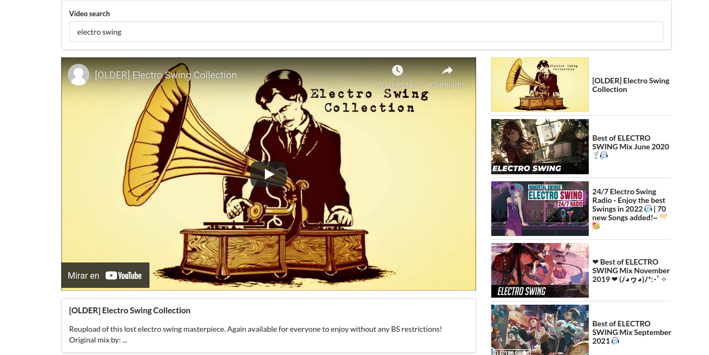

# Pics app

Simple web app created in React (using class components), user can write a word in the search bar and the app we will render a list of images related with that word.

## Screenshot

- 

## Built With

- 
- 

## Install

To get a local copy up and running follow these simple steps:

1. Go to the [repository page](https://github.com/Richie9000/videos).
2. Press the "Code" button and copy the link.
3. Clone it using git command `git clone <link>`.

### `npm start`

Runs the app in the development mode.\
Open [http://localhost:3000](http://localhost:3000) to view it in your browser.

The page will reload when you make changes.
You may also see any lint errors in the console.

## Author

👤 _Ricardo R_

- GitHub: [@Richie9000](https://github.com/Richie9000)
- Linkedin [Ricardo Rodriguez](https://www.linkedin.com/in/ricardorodr/)
